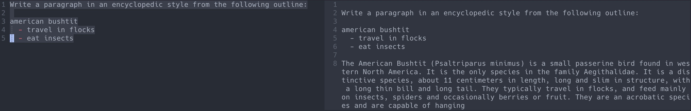

# llm.nvim

## Dependencies
1. Install [pynvim](https://github.com/neovim/pynvim): `python -m pip install pynvim`
2. Install [openai](https://github.com/openai/openai-python): `python -m pip install openai`
### Verify pynvim is detected
`:checkhealth` and verify Python 3 provider shows Python and pynvim

## Export OpenAI Key
`export OPENAI_API_KEY=YourKey`

## Install Plugin with Packer
1. Add to your `init.lua`: `use 'bybunni/llm.nvim'
2. Run `:PackerSync`
3. Run `:UpdateRemotePlugins`
4. Quit and restart Neovim

## Call Function
Add a binding for the `SelectionWindow` command e.g.

`vim.keymap.set({ 'n', 'v' }, '<leader>w', ':SelectionWindow<CR>') -- llm.nvim`

## Use
Highlight the desired text to send to GPT-3 as a prompt and invoke the
`SelectionWindow` command. After a few seconds a window will open with a scratch
buffer containing the response on the right. You can interact with this window
like any other neovim window.

